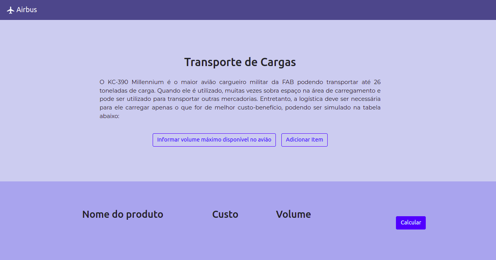
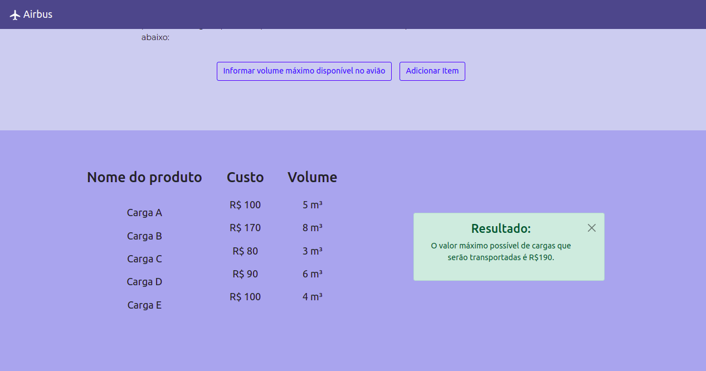

# Airbus

**Número da Lista**: 3<br>
**Conteúdo da Disciplina**: Programação Dinâmica<br>

## Alunos

| Matrícula  | Aluno                   |
| ---------- | ----------------------- |
| 19/0046091 | Gustave Augusto Persijn |
| 19/0032863 | Lorrayne Alves Cardozo  |

## Sobre

O projeto tem o objetivo de otimizar o transporte em aviões de carga utilizando programação dinâmica. Esse cálculo é feito com o algoritmo Knapsack, calculando qual o maior lucro possível de acordo com o volume máximo disponível no avião e os volumes de cada item a ser transportado.

## Screenshots
### 1. Página inicial





## Instalação

### Frameworks 
ReactJS 

### Instalar dependências
```
npm install
```

### Rodar o projeto
```
npm start
```
O projeto estará rodando na porta ```localhost:3000```

## Apresentação

[Link da apresentação](https://youtu.be/N90DxxjkiHo)